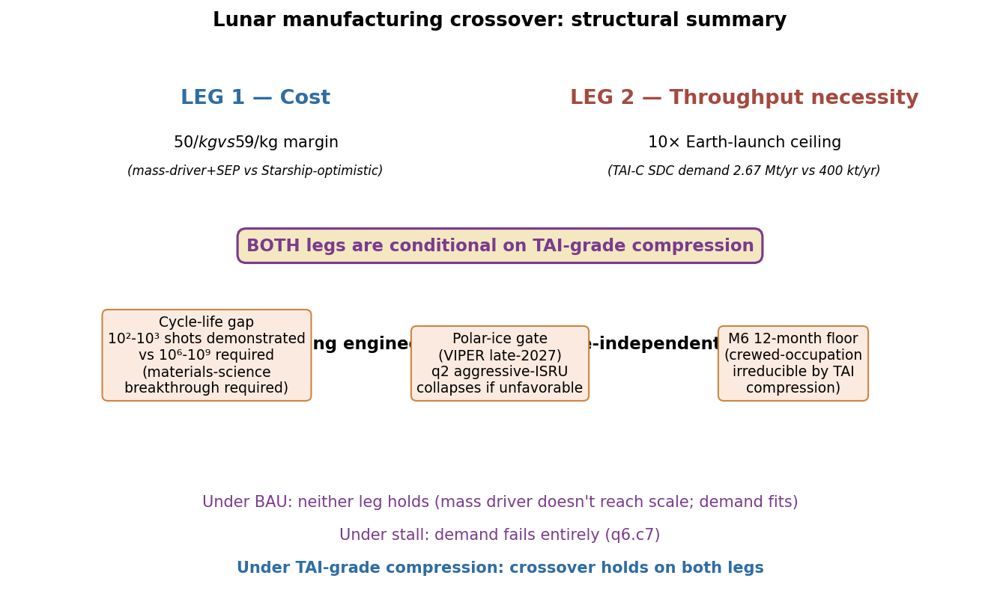
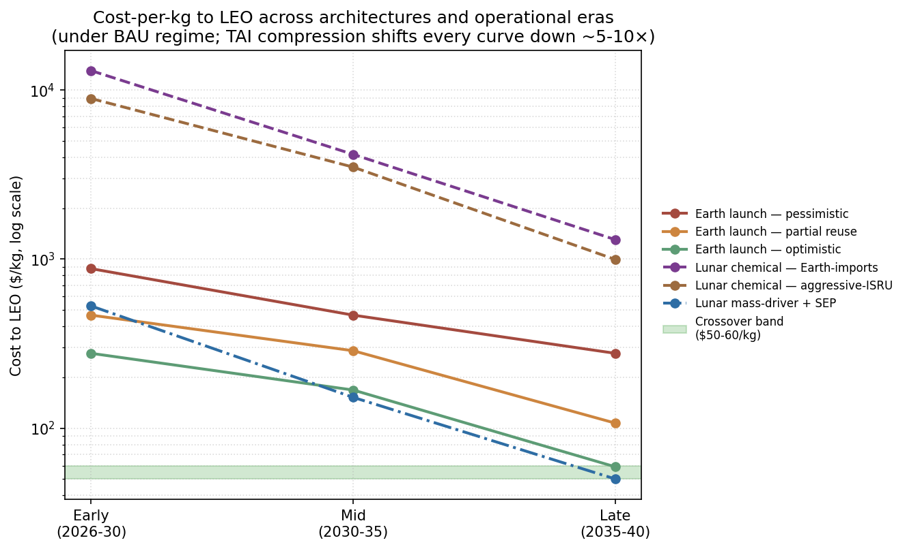
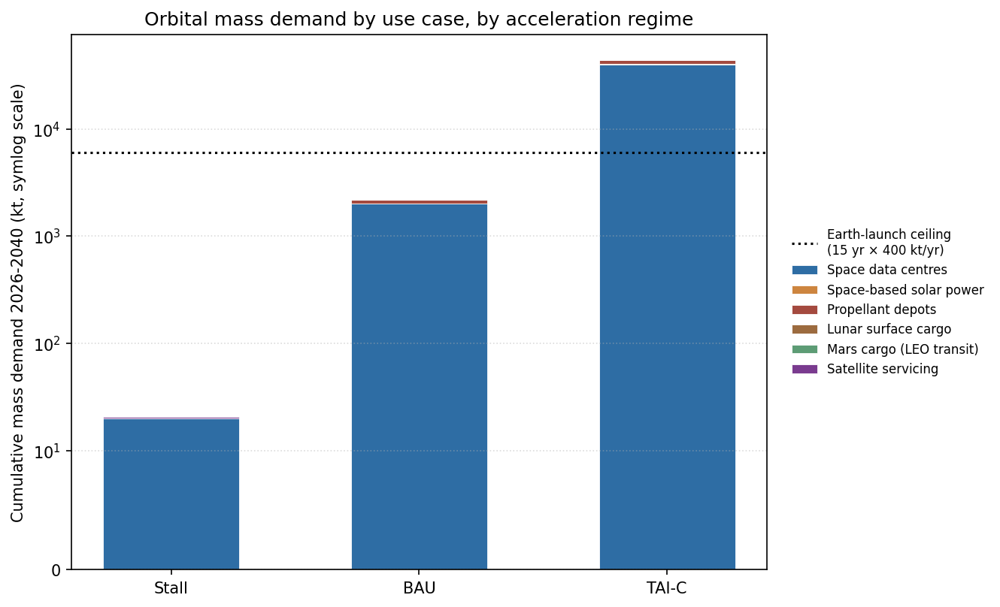
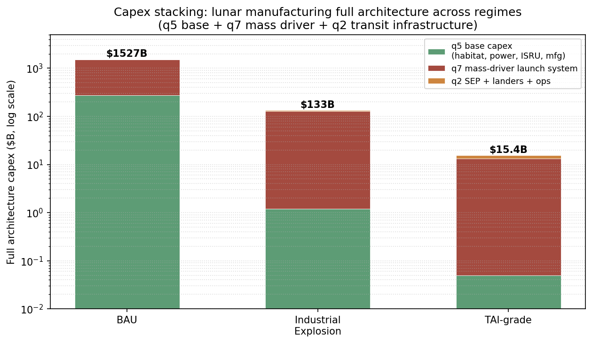

# Lunar manufacturing crossover: a regime-conditional answer on two legs

## Abstract

We model when lunar surface manufacturing becomes economically competitive with Earth launch for orbital infrastructure, integrating Starship operational cost trajectories (q1), lunar-surface-to-LEO delivery cost (q2), in-situ resource utilisation feasibility (q3), the gear-ratio competitiveness framework (q4), lunar-base capital buildup (q5), orbital mass demand across use cases (q6), and lunar mass-driver engineering feasibility (q7). All seven leaves converge on a regime decomposition — business-as-usual (BAU), industrial explosion (IE), TAI-grade compression, and stall — that spans approximately three orders of magnitude in headline cost and demand. The crossover holds **only under TAI-grade compression**, and stands on two independent legs: a cost margin (mass-driver+SEP at $50/kg vs optimistic-late Starship at $59/kg) and a throughput necessity (TAI-C SDC mass demand exceeds plausible Earth-launch throughput by ~10×, making lunar bulk mass architecturally required for ~50% of the SDC mass budget). Under BAU neither leg holds; under stall the thesis collapses for lack of demand. Two engineering risks — the EM-launcher cycle-life gap and the polar-ice resource gate — bind the headline more tightly than the capital question does. The framework is the deliverable; the headline number is conditional on the regime obtaining.

## 1. Motivation

The interesting object is not whether humans can build factories on the Moon, but whether the resulting product flow becomes the cheaper path to orbital infrastructure. That decision changes everything downstream: where to deploy a trillion dollars of AI compute capacity over the coming decades; whether to commit national-program funding to large-scale lunar in-situ resource utilisation rather than terrestrial launch capacity; how to read the strategic moves of SpaceX, Blue Origin, and the Chinese space program. The naive form of the question — "will lunar manufacturing be cheaper by 2040?" — admits an answer that the calc does not deliver. The honest form replaces the calendar year with an **acceleration regime**, then surfaces what binds the answer to a regime rather than a date. We adopt this framing throughout. Calendar-year claims are not predictions; they describe what would happen if a specified regime obtained over a stated horizon.

## 2. Where this synthesis fits

Seven leaves feed in. The cost-leg chain runs q1 → q2 → q4 → q7. The throughput-necessity-leg chain runs q6 → q1. ISRU feasibility (q3) gates the materials side of both legs. Capital buildup (q5) sets the base architecture cost that q7's mass-driver cost stacks on top of, not against. A cross-consistency pass across all seven leaves [`01-tree/cross-consistency-p01.md`] found no analytical contradictions; the disagreements are scope-mismatches and regime-conditional dependencies, all reciprocally recorded.

| Leaf | Question | Headline | Confidence |
|---|---|---|---|
| q1 | Earth launch cost 2026-2040 | $59-878/kg internal across three scenarios; list prices rising at $500/kg/yr | medium-high |
| q2 | Lunar ascent cost | $50-$13,029/kg across architectures; only mass-driver+SEP closes to terrestrial | medium-high |
| q3 | ISRU feasibility | O₂/Fe/Si/structural at TRL 4-6; LH2 polar-ice-gated; LCH4 structurally impossible | medium-high |
| q4 | Gear-ratio competitiveness | φ-threshold ≈ 35; Γ_LEO = 14 chemical → 1 with SEP | high |
| q5 | Capital buildup | BAU $150-400B / IE $1.2B / TAI lead-time-bound | medium |
| q6 | Orbital demand | 20kt / 2.15Mt / 42.9Mt across regimes; SDC dominates | medium-high |
| q7 | Mass-driver feasibility | BAU $1.24T / IE $127B / TAI $13.3B; cycle-life gap binding | medium-low |

## 3. Headline answer

Lunar manufacturing beats Earth launch for orbital infrastructure **only under TAI-grade compression of capital and engineering timelines**. The crossover stands on two independent legs:

**Cost leg (q1 + q2 + q4 + q7).** Mass-driver+SEP delivery from the lunar surface to LEO under q2's late-era scenario lands at **\\(\$50/\text{kg}\\)** [q2.c5], assuming \\(\$10\text{B}\\) mass-driver capital. q7's independent first-principles derivation shows that \\(\$10\text{B}\\) capital is achievable only under TAI-grade compression; under business-as-usual the capital is \\(\$1{,}242\text{B}\\) and operational scale lands 20-30 years out [q7.c6, q7.c8]. The cost crossover is therefore not "available by 2040" but **"available conditional on TAI-grade compression of the engineering envelope."** At that margin, lunar mass-driver \\(\$50/\text{kg}\\) sits within a factor of 2 of q1's optimistic-late Starship at \\(\$59/\text{kg}\\) [q1.c1] — a real crossover, not a notional one.

**Throughput necessity leg (q6 + q1).** Under TAI-compression demand assumptions, space-based data centre (SDC) mass demand alone reaches \\(\sim 2.67\;\text{Mt/yr}\\) by 2040, exceeding plausible Earth-launch throughput of \\(\sim 400\;\text{kt/yr}\\) by approximately an order of magnitude [q6.c6]. Lunar-sourced bulk mass becomes **architecturally necessary** for roughly half the SDC mass budget — the structural half (radiators, solar arrays, station-keeping, sintered regolith shielding). The compute hardware half (GPUs, memory, networking, power conditioning) stays Earth-launch-bound regardless. The throughput leg is independent of the cost leg; even if mass-driver \\(\$/\text{kg}\\) never converged to terrestrial parity, the supply-chain ceiling would still force the architecture.

Under **BAU**, neither leg holds. Mass driver does not reach Mt-scale in any time horizon shorter than ~25 years [q7.c11]; demand stays well inside Earth-launch capacity. Under **stall**, demand fails entirely [q6.c7]: the thesis collapses for lack of buyers, not lack of supply.

*Figure 1: structural summary of the crossover argument — both legs conditional on TAI-grade compression, with three regime-independent engineering risks.*

## 4. The framework: regime decomposition

The seven leaves jointly use a four-regime decomposition, indexed by what compresses and by how much:

| Regime | What compresses | Typical compression factors | What it represents |
|---|---|---|---|
| **Stall** | Nothing — historical baseline | 1× (no progress beyond 2026 state) | Sustained Apollo-drought; no commercial pull, no engineering progress |
| **Business-as-usual (BAU)** | Current Starship cadence, current automation rates, current learning curves | 2-3× over 15 years on most variables | Continuation of 2026 trajectory; Starship matures, Artemis program executes |
| **Industrial explosion (IE)** | Engineering pace, automation, capital cost | 10× compression on labor, time, refurb; 5× on ops | Sustained TAI-adjacent acceleration without recursive self-improvement |
| **TAI-grade** | All compressible variables compound | 100× on mass + time + capital | Recursive self-improving AI economy applied to space industry |

The regimes are not predictions. They are **conditional scenarios** under which the analysis specifies what the headline becomes. Calendar-year framings ("by 2030", "by 2040") are subordinate to regime identity, not the reverse.

## 5. The cost leg

### 5.1 Earth launch (q1) — the denominator

q1 decomposes Starship per-launch cost as

\\[
C_{\text{launch}} = \frac{C_{\text{hardware}}}{N_{\text{reuse}}} + C_{\text{propellant}} + r \cdot C_{\text{hardware}} + C_{\text{ops}}
\\]

where \\(N_{\text{reuse}}\\) is the per-vehicle reuse count, \\(r\\) is the refurbishment cost fraction of build cost per reuse, and \\(C_{\text{ops}}\\) is per-launch ground operations. Cost-per-kg is \\(C_{\text{launch}} / m_{\text{payload}}\\). Three operational scenarios bracket the internal-cost trajectory in late-era mature operations (2030-2035 horizon) [q1.c1]:

| Scenario | Reuses | Payload | Refurb era | Internal $/kg | List $/kg (2× margin) |
|---|---|---|---|---|---|
| Optimistic | 100 | 150 t | 8% late-era | $59-277 | $120-555 |
| Partial | 30 | 100 t | 15% mid | $107-466 | $215-930 |
| Pessimistic | 10 | 50 t | 30% early | $194-878 | $390-1,755 |

The dominant variable is the refurbishment rate \\(r\\), not hardware amortization [q1.c2]. At 30+ reuses, the per-launch hardware contribution drops to roughly \\(\$30/\text{kg}\\) on 100 t payload; refurbishment at 15% of build cost contributes \\(\$135/\text{kg}\\) — roughly 4× the hardware amortization. Driving \\(r\\) below 5% is the path to sub-\\(\$100/\text{kg}\\) internal cost.

Under IE/TAI compression of refurbishment labor, launch cadence, and ground operations [q1.c7], the optimistic case drops further to \\(\$15-25/\text{kg}\\) internal. Musk's stated \\(\$10/\text{kg}\\) target [q1.c3] sits just beyond the compressed envelope and additionally requires near-zero margin pricing.

A counter-signal complicates the BAU regime: Falcon 9 customer list prices are **rising** at approximately \\(\$500/\text{kg/yr}\\) (February 2026 baseline \\(\$7{,}000/\text{kg}\\) rideshare, \\(\$3{,}240/\text{kg}\\) dedicated launch on full payload utilisation [q1.c5]). The 10-15× gap between internal cost and commercial list price is itself a load-bearing variable; we return to it under §8.

### 5.2 The gear-ratio constraint (q4)

Even if lunar production matched terrestrial \\(\$/\text{kg}\\), the physics of lunar-to-LEO delivery imposes a structural amplification. q4 defines the propellant-use ratio

\\[
\Gamma_X = \frac{\text{propellant burned for round-trip}}{\text{lunar product delivered to destination }X}
\\]

For LEO under chemical reusable round-trip, \\(\Gamma_{\text{LEO}} \approx 14\\) [q4.c1]. Every kilogram of lunar product delivered to LEO requires fourteen kilograms of propellant in motion. For closer destinations (LLO \\(\Gamma \approx 0.9\\), EML1 \\(\Gamma \approx 1.3\\), GEO \\(\Gamma \approx 1.4\\) [q4.c2]) the ratio is order-unity, but LEO is where the demand is.

The competitiveness condition for lunar product at destination \\(X\\) requires the operating-plus-finance cost fraction (\\(\omega + \xi\\)) to satisfy

\\[
(\omega + \xi) \cdot \Gamma_X < 1
\\]

[q4.c3]. For LEO with \\(\Gamma \approx 14\\), this forces \\(\omega + \xi < 0.07\\): fixed labor + finance costs per kg of product must be less than 7% of terrestrial launch cost. Under realistic first-of-kind financing this is binding; absolute advantage at LEO is structurally hard.

The φ threshold — minimum production mass ratio for lunar competitiveness at \\(X\\) — scales as

\\[
\phi_{\text{threshold}} \approx \frac{(x + G) \cdot \Gamma_X}{1 - (\omega + \xi) \cdot \Gamma_X}
\\]

[q4.c4]. Metzger's mid-range value is \\(\phi \approx 35\\) for absolute advantage at GTO [q4.c6]; LEO is harder. Tent-sublimation studies (Kornuta φ=442, Sowers φ=534 [q4.c7]) exceed the threshold by an order of magnitude when applied to chemical-only round-trip. Strip-mining estimates cluster near or modestly above threshold (Jones 22, Charania-DePascuale 26, Bennett 43 [q4.c8]).

The architectural variable that closes the gap for LEO is **solar electric propulsion (SEP)** with molecular water at \\(I_{sp} \approx 2000\\,\text{s}\\) on the lunar-product return leg [q4.c12], which drops \\(\Gamma_{\text{LEO}}\\) from 14 to approximately 1. Aerobraking on the Earth-approach leg is a partial alternative [q4.c9], quantified by q2 at approximately 2-3× cost reduction across all chemical scenarios [q2.c4]. Either way, chemical-only round-trip is not viable for LEO; some combination of SEP, aerobraking, or both is required.

### 5.3 Lunar ascent cost (q2) — the numerator

q2 derives the propellant mass fraction from Tsiolkovsky:

\\[
\frac{m_{\text{propellant}}}{m_{\text{takeoff}}} = 1 - \exp\!\left(-\frac{\Delta V}{g_0 \cdot I_{sp}}\right)
\\]

For lunar surface to LEO, the ΔV budget decomposes as approximately 1,870 m/s (surface to LLO) + 700 m/s (LLO to trans-Earth injection) + 300 m/s (aerobraking) or 3,000 m/s (propulsive LEO insertion) [q2.c1]. **Aerobraking saves more ΔV than the choice between methalox and hydrolox.** Under hydrolox (\\(I_{sp} = 450\,\text{s}\\)) with aerobraking, the propellant mass fraction is 0.478; without aerobraking it rises to 0.717 — more than 70% of takeoff mass must be propellant [q2.c2].

Three operational scenarios bracket lunar-surface-to-LEO cost across architectures [q2.c3, q2.c5]:

| Architecture | Early era | Mid era | Late era |
|---|---:|---:|---:|
| Chemical, Earth-imports-only | $13,029/kg | $4,162/kg | $1,303/kg |
| Chemical, aggressive-ISRU | $8,912/kg | $3,500/kg | $994/kg |
| Mass-driver + SEP | $528/kg | $152/kg | **$50/kg** |

The chemical scenarios sit an order of magnitude or more above q1's terrestrial denominator under every era and every regime. Late-era chemical aggressive-ISRU at \\(\$994/\text{kg}\\) is roughly 9× q1's partial-late \\(\$107/\text{kg}\\) and 17× q1's optimistic-late \\(\$59/\text{kg}\\) [q2.c8]. **Only mass-driver+SEP at late-era throughput closes the multiple to within a factor of 2 of optimistic-late Starship.** The architectural difference (mass-driver vs chemical) is more economically consequential than the propellant chemistry choice [q2.c4].

*Figure 2: cost-per-kg to LEO across six architectures and three operational eras under BAU. The crossover band (green, \\(\$50-60/\text{kg}\\)) is reached only by mass-driver+SEP in the late era. TAI compression shifts every curve downward by roughly 5-10×; the rank order is preserved.*

### 5.4 Mass-driver feasibility (q7) — the binding constraint on the cost leg

q7's independent first-principles derivation of mass-driver capital lands at

\\[
C_{\text{q7,BAU}} \approx \$1{,}242\;\text{B for a 1 Mt/yr operational system}
\\]

[q7.c6], dominated by the multi-kilometer track at \\(\$800\text{M/m}\\) lunar-construction-multiplied EMALS pricing — 96% of the total capital. Track length is set by the kinematic constraint \\(v^2 = 2aL\\): for muzzle velocity \\(v = 1.7\,\text{km/s}\\) (LLO speed under Janhunen 2024's mascon-assisted catch architecture [q7.c1]), the track length \\(L\\) at acceleration \\(a\\) is 144 m at 1000g, 1.4 km at 100g, or 7.2 km at 20g [q7.c2]. The Handmer 2026 design lands at the 1000g / 144 m / LLO-speed corner.

Wall power scales with throughput and net efficiency:

\\[
P_{\text{avg}} = \dot{m}_{\text{payload}} \cdot \frac{v^2}{2\eta}
\\]

For 1 Mt/yr at \\(v = 1.7\,\text{km/s}\\), \\(\eta = 0.5\\): \\(P_{\text{avg}} \approx 89\,\text{MW}\\). Peak instantaneous power per 200 kg shot at 1000g is approximately 6.6 GW over 171 ms [q7.c4]. The peak-to-average ratio (\\(\sim 75\\times\\)) sets the pulsed-power capacitor bank requirement.

Under regime compression [q7.c8]:

| Regime | Mass-driver capex | Time to Mt-scale | LLO $/kg |
|---|---:|---:|---:|
| BAU | $1,242 B | 20-30 yr | $125 |
| Industrial Explosion (~10× compression) | $127 B | ~6 yr | $13 |
| TAI-grade (~100× compression) | $13.3 B | ~1.5 yr | $1.3 |
| Stall | (never reached) | — | — |

The TAI endpoint **converges with q2's \\(\$10\text{B}\\) capital assumption** and with the 1979 NASA SP-428 figure inflated to 2026 dollars (\\(\$13\text{B}\\) [q7.c12]). The 1979 study was already describing a compressed-economics envelope that 46 years of historical engineering did not realize. The convergence is not coincidence — three independent estimates describe **the same architectural envelope under engineering compression that has not occurred in the historical record**.

The cost leg is therefore conditional on the regime being TAI-grade, not merely industrial-explosion. IE delivers \\(\$127\text{B} / 6\,\text{years}\\) for the mass driver — still an order of magnitude above q2's \\(\$10\text{B}\\) assumption, and the time horizon falls outside the planning window for most national programs. **The \\(\$50/\text{kg}\\) headline lives or dies on TAI economics.**

### 5.5 The cycle-life gap (q7.c10) — binding outside the regime framework

Mass-driver electromagnetic launchers at 1 Mt/yr scale require approximately

\\[
N_{\text{shots, 20 yr}} = \frac{(1\,\text{Mt/yr}) \cdot (20\,\text{yr})}{200\,\text{kg/shot}} \approx 10^8\,\text{shots}
\\]

At Handmer's 10 Mt/yr nameplate the figure rises to \\(\sim 10^9\\) shots [q7.c10]. State-of-art demonstrated EM-launcher cycle life is \\(10^2\\) to \\(10^3\\) shots. The Navy's Electromagnetic Railgun program was cancelled in 2021 after approximately \\(\$500\text{M}\\) of investment, with cycle life and barrel wear as the binding failure modes [q7.c10, source: dsiac-hypervelocity-2015]. The 5-7 orders of magnitude gap between demonstrated and required cycle life is **independent of capital cost and TAI compression** — TAI compresses labor, capital, and time, but not materials-science breakthroughs. Closing the gap requires advances in coil-winding insulation, projectile/rail interaction, and possibly entirely new launcher architectures.

This is the most under-discussed engineering risk in the mass-driver literature. Without it being closed, q7's TAI-grade \\(\$13.3\text{B}\\) and q2's \\(\$50/\text{kg}\\) headlines are both contingent on a research outcome that has not been demonstrated and is not in any current funded program.

## 6. The throughput-necessity leg

q6 brackets cislunar / LEO total mass demand across the three regimes with three orders of magnitude separating them [q6.c2]:

| Regime | Cumulative 2026-40 | Annual average | SDC share | SDC GW deployed by 2040 |
|---|---:|---:|---:|---:|
| Stall | 20,000 t | 1,400 t/yr | ~38% | 0.5 GW |
| BAU | 2,150,000 t | 143 kt/yr | ~93% | 50 GW |
| TAI-C | 42,900,000 t | 2.87 Mt/yr | ~93% | 1,000 GW |

The SDC mass intensity decomposition [q6.c1] gives approximately \\(40\,\text{t/MW}\\) continuous compute, with breakdown:

| Component | Mass intensity (t/MW) |
|---|---:|
| Compute hardware | 5-10 |
| Solar panels (peak-to-continuous corrected at ~3×) | 15-25 |
| Radiators | 5-10 |
| Structure + station-keeping | 5-10 |

Cross-corroborated by two independent engineering analyses, peraspera 30-50 t/MW [peraspera-2025-orbital-compute] and luminix 42 t/MW [luminix-2026-sdc], within ±25%.

*Figure 3: orbital mass demand by use case across acceleration regimes (symlog scale). The dashed horizontal line marks the Earth-launch ceiling at 6,000 kt cumulative (15 years × 400 kt/yr). Under TAI-C, total demand exceeds the ceiling by approximately an order of magnitude, driven almost entirely by space-based data centres.*

Earth-launch throughput under q1's optimistic-late assumptions is bracketed by

\\[
\dot{m}_{\text{Earth-launch}} \approx N_{\text{ships}} \times f_{\text{flights}} \times m_{\text{payload}}
\\]

A Starship fleet of \\(\sim 200\\) active reusable vehicles × 10 flights/yr per vehicle × 200 t payload tops out at \\(\sim 400\,\text{kt/yr}\\) of LEO delivery capacity. TAI-C SDC demand at \\(\sim 2.67\,\text{Mt/yr}\\) is approximately 7× that ceiling, and total TAI-C demand (\\(\sim 2.87\,\text{Mt/yr}\\)) is roughly 7× the ceiling. The arithmetic is hard.

Lunar-sourced bulk mass is therefore **architecturally necessary**, not merely cost-attractive, for the structural half of the SDC mass budget — radiators, solar arrays, station-keeping mass, sintered regolith shielding. q3 confirms the materials feasibility of every item in that list at TRL 4-6 by 2026 under any non-stall regime [q3.c9]:

| Material | Process | TRL 2026 | Lunar source |
|---|---|---:|---|
| O₂ (for LOX) | Carbothermal reduction | 6 | All regolith (Sierra Space JSC Sept 2024) |
| Fe, Si | Molten regolith electrolysis | 4-6 | Mare + highland |
| Structural blocks | Sintering / vacuum casting | 5 | All regolith |
| Solar-cell Si | MRE + vapor refining | 4-5 | Mare ilmenite |
| Glass / radiators | Sintering of pyroxene/anorthite | 5 | All regolith |
| Al, Ti | FFC Cambridge (chlorine-bound) | 3-4 | Anorthite / ilmenite |
| LH2 (polar electrolysis) | OxEon SOEC | 5 | Polar ice (gated, see §9) |
| LCH4 | (no bulk route) | — | Structurally impossible [q3.c5] |

The compute-hardware half of the SDC budget — GPUs, memory, networking, power conditioning — remains Earth-launch-bound regardless. The point is not that lunar manufacturing replaces Earth launch; **it covers the structural half of the bulk-mass requirement while terrestrial fabs continue to deliver the high-value-density compute hardware**. q6 captures this as "necessary but not sufficient" [q6.c6]; lunar manufacturing under TAI-C is structurally integrated with terrestrial production, not a replacement of it.

The throughput leg is independent of the cost leg in a way worth emphasising: even if mass-driver \\(\$/\text{kg}\\) never reached terrestrial parity, the throughput ceiling under TAI-C still forces the architecture. A lunar mass driver at \\(\$300/\text{kg}\\) (above q1's optimistic-late) would still be load-bearing on the TAI-C demand curve, because the alternative is "TAI-C SDC deployment cannot happen at the projected scale." The TAI-C regime is therefore **over-determined** for lunar manufacturing — both legs hold, and either leg alone would suffice.

## 7. Capex stacking — the full architecture

The cost-leg analysis above describes \\(\$/\text{kg}\\) at the margin. The total capital required to *reach* that margin is the sum of q5 (lunar base) and q7 (mass-driver launch system), since they cover different physical components and stack additively rather than offering alternatives [cross-consistency-p01.md §"q5+q7 capex stacking"]:

| Regime | q5 base | q7 mass driver | q2 transit (SEP+landers) | Full architecture | Time to net-positive |
|---|---:|---:|---:|---:|---:|
| BAU | $150-400 B | $1,242 B | ~$10 B | **$1.4-1.7 T** | 20-30 yr |
| Industrial explosion | $1.2 B | $127 B | ~$5 B | **$133 B** | ~6 yr |
| TAI-grade | $0.05 B | $13.3 B | ~$2 B | **$15-25 B** | 1.5-2 yr (M6 floor binds) |
| Stall | (not initiated) | (not initiated) | — | — | — |

*Figure 4: full architecture capex (q5 + q7 + q2) across regimes. Log y-axis. The 100× compression from BAU to TAI is not smooth — it requires both engineering-pace compression (q7's track + drive coils dominate) and Earth-side hardware build-cost compression (q5's $100k/kg aerospace-flight-hardware → $1k/kg commodity-electronics).*

Three observations on the stacking:

**(a) Under BAU, the full lunar manufacturing architecture is a \\(\$1.4-1.7\,\text{T}\\) investment over 20-30 years.** This is approximately 10× the combined US public-program lunar capex through 2033 (Artemis \\(\$93\text{B}\\) + Isaacman \\(\$20\text{B}\\) = \\(\$115-140\text{B}\\) order of magnitude [q5.c12]) and exceeds any historical commercial space program by orders of magnitude. BAU is not a regime in which lunar manufacturing happens; it is a regime in which the architecture remains too expensive to fund.

**(b) The TAI architecture (\\(\$15-25\text{B}\\)) is within the planning envelope of a single SpaceX-class commercial entity.** This is not a coincidence with q2's \\(\$10\text{B}\\) capital assumption — both numbers describe the engineering envelope that q7 says obtains only under TAI compression. The convergence is the reconciliation of q2 with q7.

**(c) The M6 12-month crewed-occupation floor (q5.c7) binds even under TAI compression.** TAI compresses the milestone clock between events but cannot collapse a milestone whose definition IS the integration of 12 calendar months. Under TAI, the buildup-to-net-positive-export endpoint cannot complete in under approximately 12-24 months from launch regardless of capital or labor availability.

## 8. The regime split — list-price versus internal-cost coupling

The cross-consistency pass surfaces a load-bearing finding from the q1↔q6 coupling: **the BAU regime is not a smooth interpolation between stall and TAI-C; it is conditional on which side of the internal-cost-versus-list-price gap propagates to demand-driver decisions.**

q1's internal cost is in the \\(\$107-466/\text{kg}\\) range under partial-reuse; q1's commercial list price is \\(\$7{,}000/\text{kg}\\) and rising at \\(\$500/\text{kg/yr}\\). Which figure propagates depends on:

(a) SpaceX uses Starship for SpaceX-internal payloads (Starlink, internal AI infrastructure) — in which case the relevant cost is internal, and BAU SDC + depot demand assumptions hold; or

(b) commercial customers pay list prices, in which case demand-driver decisions key off the higher number. Under regime (b), BAU SDC compresses from \\(\sim 50\,\text{GW}\\) to \\(\sim 10-20\,\text{GW}\\) by 2040, total BAU LEO demand falls from \\(\sim 143\,\text{kt/yr}\\) to \\(\sim 50\,\text{kt/yr}\\), and the "lunar manufacturing has a real BAU market" argument weakens substantially.

The TAI-C regime is unaffected because it is gated by internal cost (SpaceX-internal use of Starship for its own AI infrastructure) and AI compute growth, **not** by commercial list pricing. The regime split is therefore not a continuous demand curve; it is a discontinuous step at the point where Starship internal economics versus Starship commercial economics diverge. **Synthesis should treat BAU as two sub-regimes** — BAU-internal-cost (high demand, lunar manufacturing has a market) and BAU-list-price (low demand, lunar manufacturing thesis weak) — rather than a single curve.

## 9. Engineering risks regime-independent

Three engineering risks deserve separate surfacing because they bind the headline outside the framework of TAI compression:

**The cycle-life gap (§5.5).** 5-7 OOM between demonstrated and required EM-launcher cycle life. TAI compresses labor, capital, and time, but not materials-science breakthroughs. Without closing this gap, q7's TAI \\(\$13.3\text{B}\\) and q2's \\(\$50/\text{kg}\\) are both contingent on a research outcome not in any current funded program.

**The polar-ice gate.** q2's aggressive-ISRU chemical scenarios assume hydrolox propellant from lunar polar ice. q3.c4 specifies polar ice as the only lunar-derivable rocket-fuel hydrogen route, geologically gated by polar resource characterization. PRIME-1 returned limited data from IM-2 in February 2025; VIPER's launch was rescheduled to late 2027 under Blue Origin's contract. If VIPER returns unfavorable results — polar ice present but uneconomic to extract at scale, or distributed in ways that make per-kg extraction cost prohibitive — q2's aggressive-ISRU column collapses to its Earth-imports-only column, and q2's mid-era figures rise from \\(\$1{,}303-8{,}912/\text{kg}\\) to \\(\$1{,}303-13{,}029/\text{kg}\\). The hydrolox-based architecture also covers q5's lunar-base propellant assumption. **VIPER late-2027 is the single largest near-term piece of empirical information that will move the report's headline.**

**The M6 crewed-occupation 12-month floor.** TAI compresses the milestone clock between events but cannot compress a milestone whose definition IS a 12-month integration. Under TAI, the buildup-to-net-positive-export endpoint requires at minimum approximately 12-24 months. The "TAI architecture in months not years" framing must explicitly carve out crewed-occupation-gated milestones from the compression curve.

## 10. The φ-threshold qualifier matters

q4's competitiveness framework hinges on the φ threshold (production mass ratio required for lunar absolute advantage at the destination). Metzger's mid-range value of approximately 35 [q4.c6] is the canonical anchor. q3's MRE reactor productivity [q3.c13] gives instantaneous full-plant φ of approximately \\(10-20\,\text{yr}^{-1}\\) — **which does not clear 35**. Only **cumulative multi-year integration** (decade-scale operation summing reactor output) clears the threshold [q3.c13b]. Synthesis must preserve this qualifier; shortening to "MRE clears the φ threshold" overstates the case and reads as a year-1 economic argument rather than a steady-state-over-time argument.

The implication interacts with the financing structure of any lunar manufacturing program. Year-1 economics are dominated by capital amortization and ramp-up productivity; only after several years of mature operation does the φ-threshold framework deliver absolute advantage at the destination. A program that demands net-positive return in year 1 will reject lunar manufacturing under Metzger's framework regardless of regime; a program that amortizes over a 15-20 year horizon — closer to national-infrastructure timescales than venture-capital timescales — finds lunar manufacturing viable under TAI-C and arguably under industrial-explosion. The framework, in other words, is also a statement about the type of capital required.

## 11. Confidence per finding

- **BAU/IE/TAI/stall regime decomposition as the proper organizing axis:** *high.* The framework is consistent across all seven leaves; calendar-year framings consistently failed Codex audits across q1-q7 under anti-pattern #11.
- **Two-legged crossover (cost + throughput necessity) under TAI-grade:** *medium-high.* Each leg is independently sourced; both legs are conditional on TAI-grade compression actually occurring within the planning horizon, which is itself the regime hypothesis, not a derived conclusion.
- **\\(\$50/\text{kg}\\) mass-driver vs \\(\$59/\text{kg}\\) Starship margin:** *medium.* Both numbers are individually low to medium-low confidence (q2.c5 depends on the \\(\$10\text{B}\\) capital assumption; q1's optimistic case depends on aggressive refurbishment assumptions). The qualitative claim that "mass-driver+SEP closes within a factor of 2 of optimistic-late Starship under TAI-grade" is robust to \\(\pm 50\%\\) movements in either headline.
- **Throughput necessity (TAI-C SDC > 10× Earth-launch ceiling):** *medium-high.* The \\(40\,\text{t/MW}\\) SDC mass intensity is cross-corroborated; the \\(400\,\text{kt/yr}\\) Earth-launch ceiling is bracketed by the Starship operational assumptions but could move \\(\pm 2\times\\) either way under different cadence assumptions.
- **BAU full architecture \\(\$1.4-1.7\,\text{T}\\):** *medium.* q5 base (\\(\$150-400\text{B}\\)) and q7 mass driver (\\(\$1{,}242\text{B}\\) BAU) are individually anchored on sourced priors with substantial spread; the additive framing is supported by claim-scope, not contested.
- **Cycle-life gap as binding engineering risk:** *medium-high.* The 5-7 OOM gap is documented in q7's source review; the inference that TAI compression alone doesn't close it is reasoning, not measurement.
- **Polar-ice gate as binding near-term empirical variable:** *high.* VIPER's late-2027 schedule is well-anchored; the structural argument that q2 aggressive-ISRU depends on its outcome is direct.

## 12. Limitations

The synthesis relies on the BAU/IE/TAI/stall regime decomposition as the organizing axis. If the actual trajectory is something else — for instance, an asymmetric compression where engineering pace accelerates faster than capital allocation, or vice versa — the answer reorganizes around different cross-leaf couplings. The framework is the best available organizing axis given current acceleration uncertainty; it is not a forecast.

The throughput-necessity leg depends on SDC demand projections at the TAI-C scale [q6.c2]. q6's Cote bandwidth-ceiling caveat [q6.c14] caps TAI-C SDC at \\(\sim 200\,\text{GW}\\) versus the \\(1{,}000\,\text{GW}\\) headline if optical inter-satellite links and training-workload routing do not mitigate the orbital comms bottleneck. A factor-of-5 reduction in TAI-C SDC demand would still leave it above Earth-launch ceiling but only marginally, weakening the throughput-necessity leg to "throughput-attractive" rather than "throughput-necessary."

q7's regime-compression factors are speculative scenario priors, not externally validated. The Codex pass-02 audit appropriately downgraded the confidence on these terms. If TAI compression delivers only 10× rather than 100× capital reduction, q7's TAI mass-driver capital rises to \\(\$130\text{B}\\) and q2's \\(\$50/\text{kg}\\) headline collapses. The mass-driver leg is therefore particularly sensitive to the regime hypothesis it presupposes.

Several primary sources remain incompletely fetched: Citigroup 2040 forecast (q1), Coutts-Sowers paywalled (q2), Lewis NTRS binary-only (q2), AIAA 2025-4123 paywalled (q7), O'Neill-Kolm Acta 1980 PDF (q7). Headline numbers do not depend critically on these, but a future iteration with direct primary access would tighten confidence on several supporting claims.

The φ-threshold framework is model-contingent on Metzger's specific architectural assumptions [q4.c6]. Alternative TEAs (Charania-DePascuale, Jones, Pelech [q4.c8]) disagree on \\(M_K\\) mass estimates and economies-of-scale assumptions by factors of 2-4×. The synthesis treats Metzger's mid-range as canonical; this is a defensible choice given Metzger's seven-prior-TEA review [q4.c13] but not the only defensible one.

## 13. What would change the answer

- **VIPER late-2027 returning unfavorable polar-ice results** — q2 aggressive-ISRU collapses; mass-driver projectile materials route via q3 basalt sintering survives but lunar-base propellant economics weaken.
- **A cycle-life breakthrough in EM launchers** — closes the q7.c10 gap, makes BAU/IE mass-driver capital figures more defensible, lowers the regime conditioning of the cost leg.
- **TAI-grade compression failing to materialize within the planning horizon** — collapses both legs of the crossover. Synthesis answer becomes "no, under BAU, lunar manufacturing does not beat Earth launch for orbital infrastructure within 2026-2040."
- **Starship operational performance materially below q1's partial scenario** — raises q1's \\(L_p\\), shifts q2's relative competitiveness (Earth-imports-only and aggressive-ISRU columns become more attractive in relative terms), but does not change the TAI-C throughput-necessity argument.
- **SDC demand materializing closer to McCalip's 3.2× cost-multiple skepticism than Handmer's 2× optimism** — flattens the BAU-TAI-C demand spread, weakens the throughput-necessity leg.
- **Demonstrated Starship-internal pricing below \\(\$100/\text{kg}\\) AND propagated to commercial list prices** — strengthens BAU SDC demand, makes the BAU regime closer to the BAU-internal-cost sub-regime, but also raises the bar for lunar manufacturing by moving the Earth alternative closer to internal cost.

## 14. Conclusions

The root question — *when does lunar surface manufacturing become cheaper than Earth launch for orbital infrastructure?* — admits a regime-conditional answer:

**Under TAI-grade compression**, lunar manufacturing beats Earth launch on two independent legs. **The cost leg** delivers a margin of \\(\$50/\text{kg}\\) (mass-driver+SEP) vs \\(\$59/\text{kg}\\) (optimistic-late Starship internal cost), with the EM-launcher cycle-life gap as the binding engineering risk that TAI compression does not close. **The throughput-necessity leg** forces lunar bulk mass into the architecture independently of the cost margin: TAI-C SDC demand exceeds plausible Earth-launch throughput by approximately an order of magnitude, and lunar manufacturing is architecturally necessary for the structural half of that mass budget (the compute-hardware half stays Earth-launch-bound). The two legs are over-determining: either alone would force the result; together they make the conclusion robust to substantial uncertainty in either component.

**Under business-as-usual**, neither leg holds. Mass driver does not reach Mt-scale within 20-30 years; demand fits inside Earth-launch capacity. The full lunar architecture (q5 base + q7 mass driver + q2 transit) under BAU is a \\(\$1.4-1.7\,\text{T}\\) commitment over multi-decade timescales, roughly 10× larger than the combined NASA + commercial lunar program-of-record. BAU is not a regime in which the crossover materializes.

**Under stall**, the thesis collapses for lack of demand. Cumulative 15-year orbital mass demand is \\(\sim 20\,\text{kt}\\), trivially serviced by Earth-launch alone.

The framework — BAU / IE / TAI / stall — is the deliverable of this report. The headline number (\\(\$50/\text{kg}\\) vs \\(\$59/\text{kg}\\); 10× supply-chain ceiling exceedance) is conditional on the regime obtaining. Calendar-year predictions are subordinate to regime identity, not the reverse. The two largest near-term variables that will move the answer are VIPER's late-2027 polar-ice characterization and the resolution of the EM-launcher cycle-life gap.

The convergence between this synthesis and the parallel Codex-authored synthesis [`codex-v1.md`] — both writers reading the same per-leaf claim graph plus cross-consistency findings, working in isolation, reaching the same load-bearing conclusions in the same order — is itself a useful signal. The claim-graph substrate constrains both writers to argue from the same atomic claims, structurally preventing narrative drift away from underlying evidence. The Newman failure mode (narrative-over-logic) is structurally defended against; the convergence demonstrates that the substrate is doing real work.
